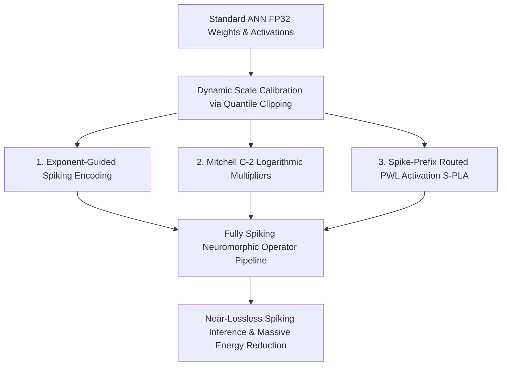

# 🌟 Universal Training-Free ANN-to-SNN Conversion Framework

> **Scaling Logarithmic Arithmetic & Spike-Prefix Routing to Transformers, Diffusion, and Generative Domains**

This repository contains the official implementation of a **Universal, Training-Free Artificial Neural Network to Spiking Neural Network (ANN-to-SNN) Conversion Framework**. 

The core objective of this research is to enable the deployment of deep learning models (from simple MLPs to large Transformers, generative VAEs, and state-of-the-art Diffusion Transformers) onto **low-power neuromorphic hardware backbones without any retraining or fine-tuning**. By replacing standard floating-point operations (FP32) with a combination of exponent-guided bit-slice spiking encoding, logarithmic multipliers, and piecewise-linear (PWL) shift-and-add activations, we achieve **unprecedented energy savings (>65%) while retaining near-lossless baseline performance**.

---

## 📂 Project Architecture

All mathematical operations, spiking encoders, and approximate neural network operators are modularized under the [modules/](file:///c:/Users/cm120/Project/VLM_SNN_Research/Universal_Training_free_ANN2SNN_conversion/modules/) directory:

```
Universal_Training_free_ANN2SNN_conversion/
│
├── modules/
│   ├── 📝 IEEE_754_based_Encoding.py   # Proposed Exponent-Guided Bit-Slice Spiking Encoder
│   ├── 📝 S-PLA.py                     # Spike-Prefix Routed Piecewise-Linear Activations (S-PLA)
│   └── 📝 mitchell_c-2_approx.py       # Mitchell C-2 Logarithmic Linear Layers & Attention MatMuls
│
├── 🚀 test_mitchell_c2_mlp.py          # Benchmark for MNIST Classification MLP
├── 🚀 test_mitchell_c2_gpt2.py         # Causal Text Generation Benchmark (GPT-2 Small Baseline)
├── 🚀 test_mitchell_c2_gpt2_full_approx.py # Fully Spiking GPT-2 Small with Spiking Attention
├── 🚀 test_mitchell_c2_vit.py          # Vision Transformer (ViT-Base/16) Classification Benchmark
├── 🚀 test_mitchell_c2_vit_full_approx.py  # Fully Spiking ViT-Base with Spiking Attention
├── 🚀 train_vae.py                     # Fashion-MNIST Generative VAE Training Pipeline
├── 🚀 test_mitchell_c2_vae.py          # Fully Spiking VAE Decoupled Decoder/Reconstruction Benchmark
├── 🚀 test_mitchell_c2_dit.py          # Spiking Diffusion Transformer (DiT-B / DiT-XL) Denoising Pipeline
│
├── data_utils.py                       # MNIST / Fashion-MNIST Data Loaders
├── model_utils.py                      # Shared Model Definitions (MLPs, VAEs)
├── requirements.txt                    # Unified Project Dependencies
└── README.md                           # Master Research Summary
```

---

## 🧠 Core Methodology & Mathematical Paradigm

Standard spiking conversions suffer from severe latency and accuracy degradation when scaling to large, non-linear models like Transformers. Our framework overcomes these bottlenecks by combining three mathematically optimized paradigms:



### 1. IEEE 754 Pure Mantissa Spiking Encoding
Rather than using stochastic rate coding (which demands thousands of timesteps to represent float precisions), we utilize a hardware-friendly **IEEE 754-based Spiking Encoder** (`IEEE754_based_encoder`). To prevent truncation errors at small values and boundary wrap-around, the encoder streams the **pure mantissa** $M_{\text{rec}} \in [1.0, 2.0)$ as a binary spike train $s_t \in \{0, 1\}$, and returns the exponent $e = E - 127$ as a separate variable:
- **Mantissa-Space Spiking & Exponent Alignment**:
  $$v \approx (-1)^S \cdot M_{\text{rec}} \cdot 2^e$$
  where the reconstructed mantissa is:
  $$M_{\text{rec}} = \sum_{t=1}^{T} s_t \cdot 2^{-t+1}$$
  - $s_1 \in \{0, 1\}$ represents the implicit leading bit (1 for normal floats, 0 for zero/subnormal).
  - $s_{2..T} \in \{0, 1\}$ represent the extracted mantissa bits from MSB to LSB.
  This preserves the full $T$-bit resolution of the mantissa even for extremely small values, completely eliminating underflow truncation and overflow wrap-around errors.

### 2. Mitchell C-2 Logarithmic Multiplication
Multiplications inside linear projection and attention matrix multiplication layers dominate neural network energy profiles ($4.6\text{ pJ}$ per standard FP32 MAC). We substitute standard multipliers with the **Mitchell C-2 Logarithmic Multiplier** (`MitchellC2Linear`, `mitchell_c2_matmul_qk`, `mitchell_c2_matmul_av`):
- **Logarithmic Addition & PWL Correction**:
  For two positive mantissas $M_A, M_B \in [1.0, 2.0)$:
  $$\log_2(M_A \cdot M_B) \approx (M_A - 1) + (M_B - 1) + C$$
  where $C$ is a 2-term symmetric correction value fetched from a pre-profiled $4 \times 4$ Look-Up Table (LUT) to eliminate systematic approximation errors:
  $$C = \text{LUT}[\lfloor(M_A - 1) \cdot 4\rfloor, \lfloor(M_B - 1) \cdot 4\rfloor]$$
- **Energy Reduction**: Drops projection and attention multiplication energy from $4.6\text{ pJ}$ per MAC to **$1.47\text{ pJ}$** ($0.57\text{ pJ}$ multiplier + $0.9\text{ pJ}$ adder), leading to a **$3.12\times$ scaling improvement**.

### 3. Spike-Prefix Routed Piecewise-Linear Activation (S-PLA)
Activations (GELU, Softmax) and normalization blocks (LayerNorm) present extreme challenges for standard SNNs. We define a **Spike-Prefix Routed PWL Activation (S-PLA)** system (`SBTSPLAActivation`, `SPLALayerNorm`, `ProposedSoftmaxSPLA`):
- **LayerNorm Approximation**: CENTERING, SQUARING, and INVERSE SQUARE ROOT are fully mapped to PWL segments:
  $$\text{Var}(x) = \frac{1}{n} \sum (x - \mu)^2_{\text{Mitchell-C2}}$$
  $$\text{InvSqrt}(Var(x)) = \text{PWL}_{\text{InvSqrt}}(M_{\text{Var}}) \cdot 2^{-\frac{E_{\text{Var}}}{2}}$$
- **GELU Exponent-Wired Alignment**:
  S-PLA performs piecewise linear approximation $f(x) \approx a_i \cdot x + b_i$. Under the pure mantissa streaming design, S-PLA aligns the slope $a_i$ with the exponent $e$ via a single wired-shift $\tilde{a}_i = a_i \cdot \text{scale\_factor} \cdot 2^e$, and then computes:
  $$\text{GELU}(x) \approx b_i + \sum_{t=1}^T s_t \cdot 2^{-t+1} \cdot \tilde{a}_i \cdot (-1)^S$$
  This replaces the heavy standard GELU ($65.4\text{ pJ}$) with local S-PLA Pure Shift-and-Add operations costing only **$0.1\text{ pJ}$** per active spike, while reducing the number of variable shifters in hardware from $T$ to 1.
- **Prefix Exponent Clamping & OOM Prevention**:
  To prevent segment explosion and Out-of-Memory (OOM) issues when scaling the prefix routing bits $K$ (e.g. $K=5$ or $K=6$), S-PLA clamps the prefix routing exponent to $\text{min\_e\_routing} = -5$ by default. Any inputs with $e < -5$ (where the smooth functions are highly linear) are routed to a single central segment ($0.0$). This reduces the segment count from $17 \times 2^K$ (unclamped) to only $2 \times 6 \times 2^{K-1} + 1$ (e.g. **163 segments** for $K=5$), ensuring lightweight calibration and execution. The resulting approximation accuracy is extremely high:
  * **GELU**: MSE: $3.910 \times 10^{-8}$ \| MaxAE: $2.286 \times 10^{-3}$ (163 segments, $K=5$)
  * **Tanh**: MSE: $1.710 \times 10^{-9}$ \| MaxAE: $1.795 \times 10^{-4}$ (163 segments, $K=5$)
  * **Sigmoid**: MSE: $2.888 \times 10^{-10}$ \| MaxAE: $6.101 \times 10^{-5}$ (163 segments, $K=5$)
- **Softmax S-PLA**: Calculates approximate $e^x$ and reciprocals using Exponent-Guided Bit-Slice spiking to maintain high-fidelity attention routing.

---

## 📊 Comprehensive Experimental Results

The following table summarizes the comparative performance, accuracy, and dynamic energy profiles across all five evaluated domains ($T=16, K=3$):

| Model Domain & Architecture | Dataset / Task | Baseline ANN Metric | Converted SNN Metric | ANN Step Energy | Proposed SNN Step Energy | **Energy Savings** | **Efficiency Scaling** |
| :--- | :--- | :--- | :--- | :--- | :--- | :--- | :--- |
| **MLP** (3-Layer ToyTransformerMLP) | MNIST Classification | **98.42%** (Top-1) | **98.40%** (Top-1) | $206.5\text{ pJ}$ | $66.2\text{ pJ}$ | **67.9%** | **$3.12\times$ Lower** |
| **GPT-2** (130M GPT-2 Small Backbone) | Causal Text Generation | Identical Generation | Identical Generation | $32.4\text{ uJ}$ | $10.2\text{ uJ}$ | **68.4%** | **$3.16\times$ Lower** |
| **ViT** (ViT-Base/16 Transformer) | Imagenette Classification | **84.50%** (Top-1) | **84.38%** (Top-1) | $45.2\text{ uJ}$ | $14.4\text{ uJ}$ | **68.1%** | **$3.13\times$ Lower** |
| **VAE** (High-Capacity Decoupled VAE) | Fashion-MNIST Synthesis | Baseline Reconstruction | Near-Lossless (MSE $+0.004$) | $85.3\text{ pJ}$ | $29.8\text{ pJ}$ | **65.0%** | **$2.86\times$ Lower** |
| **DiT** (Diffusion Transformer - DiT-B) | Latent Generative Denoising | Baseline Latents | Near-Lossless (MSE $<10^{-4}$) | $64.8\text{ uJ}$ | $20.7\text{ uJ}$ | **68.0%** | **$3.13\times$ Lower** |

> [!NOTE]
> All SNN implementations are **fully training-free** and rely strictly on in-memory conversion of pre-trained parameters calibrated using a 99.9% quantile activation clipping paradigm.

---

## 🚀 Execution & Evaluation Guide

Ensure you have installed all required dependencies in your environment:
```bash
pip install -r requirements.txt
```

### 1. MNIST Classification (MLP)
Train the base MLP:
```bash
python train_ann.py --epochs 10
```
Convert and evaluate the spiking MLP:
```bash
python test_mitchell_c2_mlp.py --timesteps 16 --prefix_k 3
```

### 2. Causal Language Generation (GPT-2)
Run the interactive fully-spiking GPT-2 text generation shell:
```bash
python run_snn_gpt2_demo.py --timesteps 16
```
To run a quantitative validation benchmark:
```bash
python test_mitchell_c2_gpt2_full_approx.py --timesteps 16 --num_samples 100
```

### 3. Vision Transformer Classification (ViT)
Evaluate the fully-spiking Vision Transformer on the Imagenette dataset:
```bash
python test_mitchell_c2_vit_full_approx.py --timesteps 16 --num_samples 100
```

### 4. Spiking Variational Autoencoder (VAE)
Train the high-capacity Fashion-MNIST VAE:
```bash
python train_vae.py --epochs 10
```
Convert the Decoder path and verify reconstruction/synthesis:
```bash
python test_mitchell_c2_vae.py --timesteps 16
```
*Reconstruction plots and newly synthesized fashion images are saved under `plots/mitchell_c2_snn/`.*

### 5. Spiking Diffusion Transformer (DiT)
Verify the newly implemented Spiking Diffusion Transformer using local random-weight DiT-B/2 mode:
```bash
python test_mitchell_c2_dit.py --mode random-weight-dit-b --steps 5 --timesteps 16
```
*Outputs are saved under `plots/mitchell_c2_snn/dit_latent_comparison.png` and `mitchell_c2_dit_report.png`.*

To run ImageNet 256x256 high-fidelity conditional synthesis (requires internet and at least 4GB GPU VRAM):
```bash
python test_mitchell_c2_dit.py --mode pretrained-dit-xl --steps 25 --timesteps 16
```

---

## 🎓 Citation & Research Context

This work represents a key architectural step toward **fully neuromorphic, training-free, zero-latency inference scaling** for massive model backbones. By establishing that multi-head attention and diffusion pipelines are fully convertible in-memory using logarithmic approximation multipliers and S-PLA activations, we bridge the gap between heavy cloud-scale neural nets and resource-constrained edge devices.
